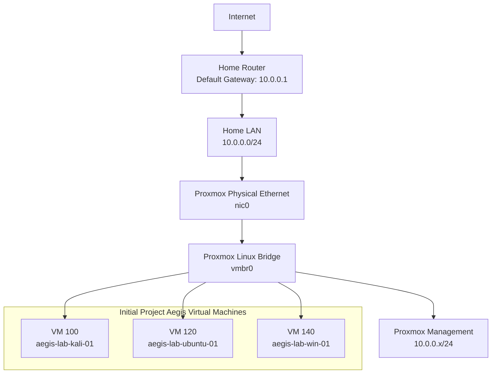

# Project Aegis Current Network Architecture

## Current State

## Current Design Notes

* `nic0` provides the physical Ethernet connection.
* `vmbr0` functions as the virtual switch.
* The Proxmox management interface is assigned to `vmbr0`.
* Initial virtual machines will connect directly to `vmbr0`.
* The home router currently provides DHCP, DNS forwarding, routing, and internet access.
* No dedicated lab segmentation currently exists.
* pfSense and isolated bridges will be introduced in a later milestone.

## Current Risk

All systems connected to `vmbr0` share the home-network trust zone.

Intentionally vulnerable machines and advanced security testing will be moved to an isolated network before those activities begin.
