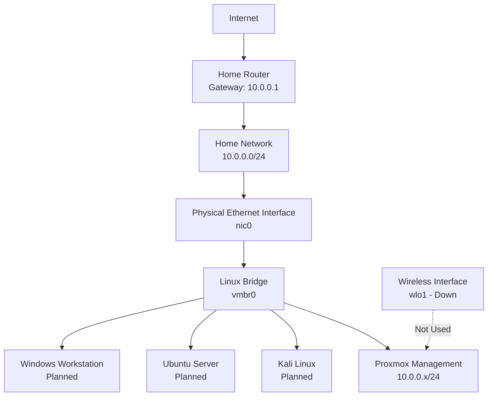

# Current Proxmox Network Architecture

## Purpose

This document describes the initial Project Aegis network configuration before pfSense, segmentation, or dedicated security networks are introduced.

The current configuration provides simple connectivity for the Proxmox host and early virtual machines. It is intended for initial deployment, operating-system installation, updates, and basic testing.

---

## Current Network Summary

| Field                       | Value                           |
| --------------------------- | ------------------------------- |
| Home network                | `10.0.0.0/24`                   |
| Default gateway             | `10.0.0.1`                      |
| Proxmox management address  | `10.0.0.x/24`                   |
| Physical Ethernet interface | `nic0`                          |
| Wireless interface          | `wlo1`                          |
| Linux bridge                | `vmbr0`                         |
| Current network type        | Bridged home-network connection |
| DHCP source                 | Home router                     |
| Current segmentation        | None                            |

The exact Proxmox management address is intentionally sanitized in public documentation.

---

## Physical Interface

The Proxmox host uses the physical Ethernet interface:

```text
nic0
```

The interface is active but does not have an IP address assigned directly to it.

Instead, it acts as a physical member of the Linux bridge `vmbr0`.

This allows the Proxmox host and connected virtual machines to communicate through the same physical Ethernet connection.

---

## Wireless Interface

The laptop also contains the wireless interface:

```text
wlo1
```

The wireless interface is currently down and is not used by Project Aegis.

Ethernet is preferred for the Proxmox management connection because it provides more consistent connectivity and works more reliably with bridged virtual networking.

---

## Linux Bridge

The Proxmox host uses:

```text
vmbr0
```

`vmbr0` is a Linux bridge that functions similarly to a virtual Ethernet switch.

The bridge connects:

* The Proxmox management interface
* The physical Ethernet interface
* Virtual machines assigned to `vmbr0`

The Proxmox management IP address is assigned to `vmbr0`, not directly to `nic0`.

---

## Current Traffic Path

The current traffic path is:

```text
Internet
   |
Home Router
   |
Home LAN
   |
Physical Ethernet Interface: nic0
   |
Linux Bridge: vmbr0
   |
Proxmox Management Interface
and Connected Virtual Machines
```

A virtual machine connected to `vmbr0` behaves like another physical device connected to the home network.

It can normally receive an IP address from the home router through DHCP.

---

## Routing Configuration

The Proxmox host uses the following default route:

```text
default via 10.0.0.1 dev vmbr0
```

The directly connected network is:

```text
10.0.0.0/24 dev vmbr0
```

The Proxmox host uses its management address on `vmbr0` as the source address for communication with the home network.

---

## Initial Virtual Machine Connectivity

The first Project Aegis virtual machines will initially connect to `vmbr0`.

Planned systems include:

| System              | Initial network |
| ------------------- | --------------- |
| Kali Linux          | `vmbr0`         |
| Ubuntu Server       | `vmbr0`         |
| Windows workstation | `vmbr0`         |

This configuration will allow the systems to:

* Receive DHCP addresses
* Access the internet for updates
* Communicate with one another
* Be managed from trusted home-network devices

---

## Security Limitations

The current network design does not provide isolation between lab systems and the home network.

Potential risks include:

* A vulnerable VM may communicate with other home devices.
* Kali Linux can reach systems outside the intended lab scope.
* Vulnerable services may be visible to the home network.
* Malware simulations could affect unintended systems if used carelessly.
* Firewall testing is limited because traffic does not pass through a dedicated lab firewall.
* Trust boundaries are not enforced.

---

## Current Security Controls

The following controls apply during the initial phase:

* No Proxmox administrative ports are forwarded through the home router.
* The Proxmox web interface is accessible only from the trusted internal network.
* Kali Linux is used only against systems owned by Project Aegis.
* Intentionally vulnerable systems are not exposed directly to the internet.
* Testing is limited to authorized lab systems.
* Vulnerable VMs should be powered off when not required.
* Sensitive attack simulations will wait until isolated networking is configured.

---

## Future Network Design

A later milestone will introduce pfSense and additional Linux bridges.

The planned design will contain separate network zones such as:

* Management
* Servers
* Workstations
* Security tools
* Monitoring
* DMZ

The future design will allow Project Aegis to:

* Restrict traffic between systems
* Create firewall rules
* Test blocked and permitted connections
* Isolate intentionally vulnerable systems
* Monitor traffic through a controlled gateway
* Document trust boundaries
* Apply default-deny security principles

---

## Current-State Architecture



---

## Trust Boundary Review

The current primary trust boundary is the home router.

Inside the home network, Project Aegis systems are not yet separated from trusted household devices.

| Boundary                 | Current control            | Limitation                                 |
| ------------------------ | -------------------------- | ------------------------------------------ |
| Internet to home network | Home router and NAT        | Depends on router configuration            |
| Home network to Proxmox  | Internal network access    | No dedicated management VLAN               |
| Home network to lab VMs  | None beyond host firewalls | Lab systems are not isolated               |
| VM-to-VM communication   | Same bridge                | No network segmentation                    |
| Administrative access    | Proxmox credentials        | Root access currently has broad privileges |

---

## Validation Commands

The following commands were used to inspect the network configuration:

```bash
ip -br address
```

Displays interfaces, status, and assigned addresses.

```bash
ip route
```

Displays the default gateway and connected networks.

```bash
cat /etc/network/interfaces
```

Displays the Proxmox network configuration.

```bash
bridge link
```

Displays interfaces connected to Linux bridges.

---

## Validation Checklist

* [x] Physical Ethernet interface identified
* [x] Wireless interface identified
* [x] Linux bridge identified
* [x] Proxmox management network documented
* [x] Default gateway documented
* [x] Current traffic path documented
* [x] Current security limitations documented
* [x] Future segmentation requirements identified
* [ ] First virtual machine connectivity tested
* [ ] DHCP assignment tested
* [ ] VM-to-VM connectivity tested
* [ ] Host firewall configuration reviewed

---

## Evidence

Recommended evidence should be stored in:

```text
screenshots/proxmox/
```

Suggested files:

```text
proxmox-network-overview.png
proxmox-interface-summary.png
proxmox-routing-table.png
```

Screenshots must be reviewed and sanitized before being committed.

---

## Next Steps

1. Add the network architecture diagram to the diagrams directory.
2. Capture a sanitized screenshot of the Proxmox network interface page.
3. Review the Proxmox firewall status.
4. Prepare the Kali Linux ISO.
5. Create the first Project Aegis virtual machine.
